# Microsoft Defender for Office365 Azure Connector for VMRay Advanced Malware Sandbox

**Latest Version:** 1.0.0 - **Release Date: 28/10/2025** 

## Overview

This project provides an integration between Microsoft Defender for Office 365 and VMRay products — FinalVerdict and TotalInsight.
Its goal is to streamline alert triage and enhance protection by automatically enriching Defender with malicious Indicators of Compromise (IOCs) identified by VMRay.

## Why to integrate MDO with VMRay?

# Understand Attacker Intent
Gain full visibility into the next stage of a phishing attack with detailed insight into attacker behavior and objectives.
# Streamline Alert Triage
Get instant clarity within Microsoft Defender alerts — including verdicts, malware names, classifications, and VTI data. The integration automatically analyzes both the phishing URL(s) and any payloads they may download.
# Enhance Protection
Automatically add IOCs from VMRay analysis to Microsoft Defender indicators, strengthening defenses and preventing future attacks.
# Accelerate Incident Response
Access comprehensive, in-depth sandbox reports directly from VMRay to speed up investigation and resolution.

## Technical Solution Overview
- The connector build using Azure Function App.
  1. The function app is time triggered function app.
  2. It's continuously fetching `O365` alerts from defender portal.
  3. Azure function app `VMRay_O365` checks if the alert contains a Url and checks if the Url has already been analyzed by VMRay.
  4. If the Url was already analysed, it checks the time period configured by the user to reanalyze the Url.
  5. Azure function app `VMRay_O365` uses advance hunting query to fetch Urls.
  6. If Url present `VMRay_O365` submit that Url to VMRay.
  7. Once VMRay analyse the Url `VMRay_O365` fetch the sample details and add the details to alert's comment.
## Features
- Automatic URL Extraction from Defender Alerts: The connector automatically retrieves URLs from multiple Defender alert types, including: Emails reported as phishing or spam, Detected malicious emails, Phishing or blocked URLs, Potentially malicious URL clicks, Emails removed after delivery and any Custom alerts you may create,
- Configurable URL Submission to VMRay: URLs are submitted to VMRay for analysis if no prior analysis exists within a configurable time window (e.g., the past x days).
- Comprehensive Analysis Integration: Analysis results for all samples—including multiple URLs and any child samples—are added as comments to the corresponding Microsoft Defender alert. Each comment includes the analysis date for traceability.
- Automatic IOC Enrichment in Defender: Malicious and suspicious IOCs identified by VMRay are automatically added as Microsoft Defender indicators. Separate configurable actions (e.g., block, audit) can be defined for Malicious vs. suspicious verdicts, and files vs URLs/IPs). IOC expiration time is fully configurable.
- Incident Tagging in Defender: Defender incidents are automatically tagged with the most severe verdict identified by VMRay (across multiple related alerts) and the associated threat name extracted from analyzed URLs
- Serverless Architecture: The connector is deployed on Azure as a serverless function app with blob storage. Deployment is simplified via a one-click setup directly from GitHub.
- Simplified Debugging and Logging: Detailed execution logs are available within the Azure Function App. Alerts are annotated if no URL is found or if the function encounters an error during execution
- Configurable Polling Interval: The frequency at which Defender alerts are fetched (polling interval) can be adjusted to fit operational requirements.
# Known Issues
- Teams Alerts: URLs cannot currently be extracted from Teams alerts due to API limitations in Microsoft Defender and Microsoft Graph.
- Email Attachments: File attachments from emails are not analyzed, as they become inaccessible once the email has been removed or quarantined.
## Requirements
- Microsoft Defender for Office365.
- VMRay FinalVerdict, VMRay TotalInsight.
- Microsoft Azure
  1. Azure functions with Flex Consumption plan.
     Reference: https://learn.microsoft.com/en-us/azure/azure-functions/flex-consumption-plan
	 **Note: Flex Consumption plans are not available in all regions, please check if the region your are deploying the function is supported, if not we suggest you to deploy the function app with premium plan. **
	 Reference: https://learn.microsoft.com/en-us/azure/azure-functions/flex-consumption-how-to?tabs=azure-cli%2Cvs-code-publish&pivots=programming-language-python#view-currently-supported-regions
  2. Azure storage with Standard general-purpose v2.

## VMRay Configurations

- In VMRay Console, you must create a Connector API key by following the steps below:
  
  1. Create a user dedicated to this API key (to avoid that the API key is deleted if an employee leaves)
  2. Create a role that allows to "View shared submission, analysis and sample" and "Submit sample, manage own jobs, reanalyse old analyses and regenerate analysis reports".
  3. Assign this role to the created user
  4. Login as this user and create an API key by opening Settings > Analysis > API Keys.
  5. Please save the keys, which will be used in configuring the Azure Function.

## Microsoft Defender for Endpoint Configurations

### Creating Application for API Access

- Open [https://portal.azure.com/](https://portal.azure.com) and search `Microsoft Entra ID` service.

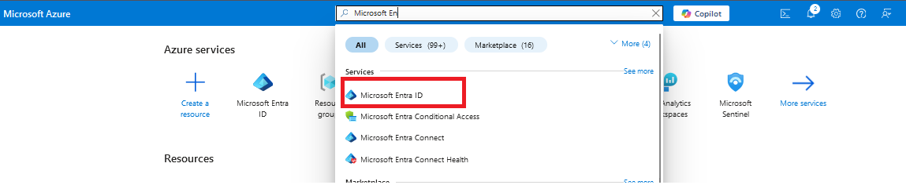

- Click `Add->App registration`.

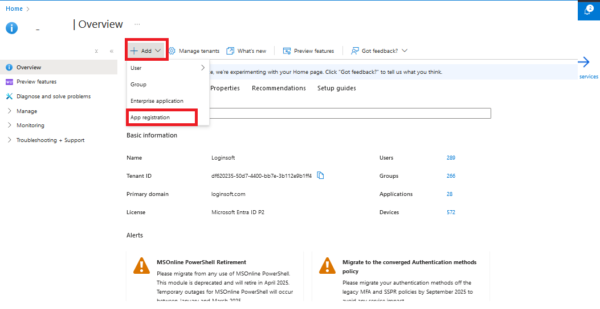

- Enter the name of application, select supported account types, and click on `Register`.

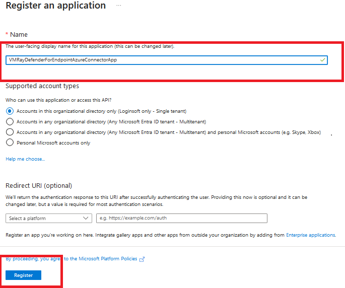

- In the application overview you can see `Application Name`, `Application ID` and `Tenant ID`.

- After creating the application, we need to set API permissions for connector. For this purpose,
  - Click `Manage->API permissions` tab
  - Click `Add a permission` button
  - Select `APIs my organization uses`
  - Search `WindowsDefenderATP` and click the search result

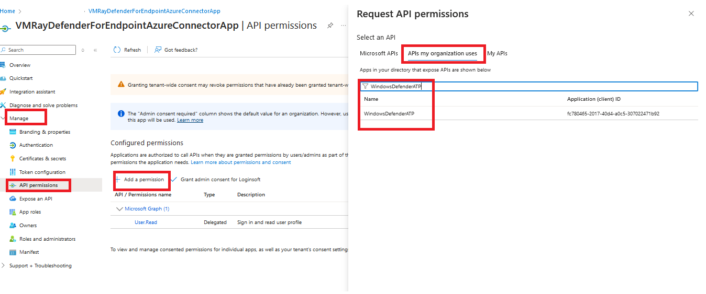

- On the next page, select `Application Permissions` and check the permissions according to the table below. Then, click `Add permissions` button below.
### WindowsDefenderATP
|       Category       |   Permission Name   | Description                                                            |
|:---------------------|:--------------------|:-----------------------------------------------------------------------|
| Alert                | Alert.Read.All      | Needed to retrieve alerts and related evidence                         |
| Alert                | Alert.ReadWrite.All | Needed to enrich alerts with sample information                        | |
| Ti                   | Ti.Read.All | Needed to retrieve indicators                                          |
| Ti                   | Ti.ReadWrite | Needed to retrieve and submit indicators (application specific)        |
| Ti                   | Ti.ReadWrite.All | Needed to retrieve and submit indicators (general)                     |

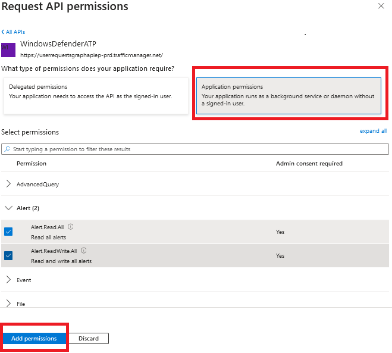

- Follow the same steps as above to provide permission for `Microsoft Graph API`

### WindowsDefenderATP
| Category                      | Permission Name     | Description                                                           |
|:------------------------------|:--------------------|:----------------------------------------------------------------------|
| SecurityAlert.Read.All        | Alert.Read.All      | Read all security alerts                                              |
| SecurityAlert.ReadWrite.All   | Alert.ReadWrite.All | Read and write to all security alerts                                 |
| SecurityIncident.Read.All     | Incident.Read.All   | Read all security incidents                                         |
| SecurityIncident.ReadWrite.All| Incident.ReadWrite  | Read and write to all security incidents       |
| ThreatHunting.Read.All        | Hunting.Read.All    | Run hunting queries                    |

- After setting only the necessary permissions, click the `Grant admin consent for ...` button to approve permissions.

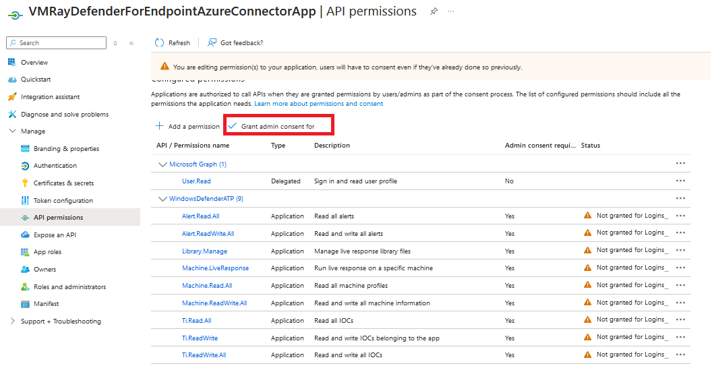

- We need secrets to access programmatically. For creating secrets
  - Click `Manage->Certificates & secrets` tab
  - Click `Client secrets` tab
  - Click `New client secret` button
  - Enter description and set expiration date for secret

- Use Secret `Value` and `Secret ID` to configure connector.

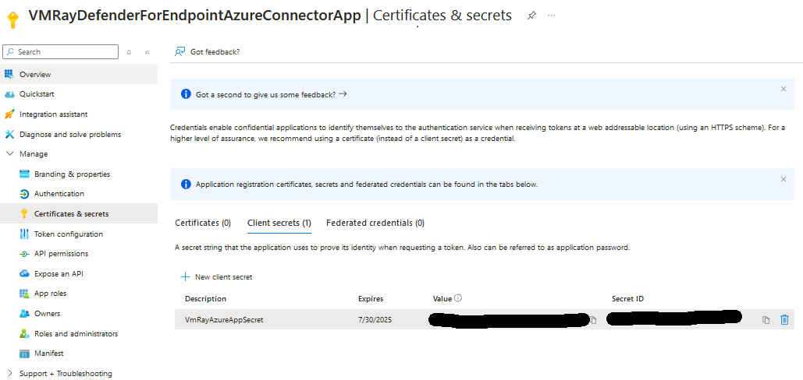

**Reference**
- [https://docs.microsoft.com/en-us/microsoft-365/security/defender-endpoint/api-hello-world](https://docs.microsoft.com/en-us/microsoft-365/security/defender-endpoint/api-hello-world)

## Microsoft Azure Function App Installation And Configuration

### Deployment of Function App 

#### Flex Consumption Plan

- Click on below button to deploy:

  

- On the next page, please provide the values accordingly.
  
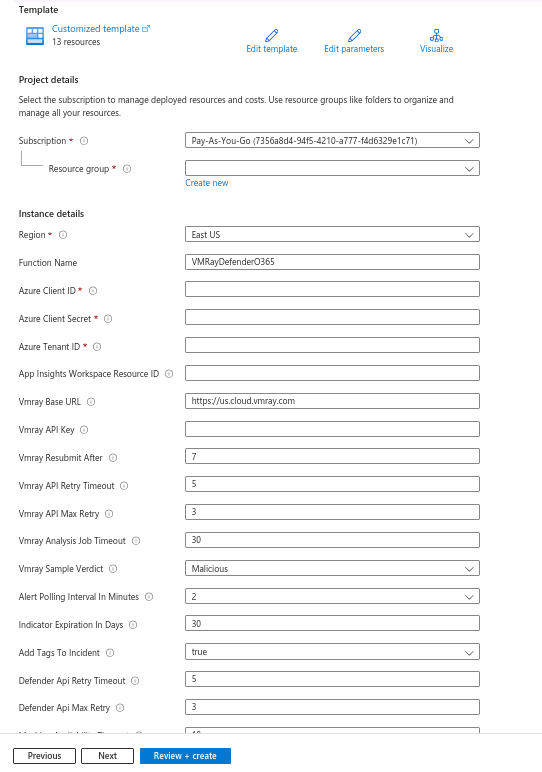

| Fields                                                  | Description                                                                                                                                        |
|:--------------------------------------------------------|:---------------------------------------------------------------------------------------------------------------------------------------------------
| Subscription		                                          | Select the appropriate Azure Subscription                                                                                                          | 
| Resource Group 	                                        | Select the appropriate Resource Group                                                                                                              |
| Region			                                               | Based on Resource Group this will be auto populated                                                                                                |
| Function Name		                                         | Please provide a function name if needed to change the default value                                                                               |
| Azure Client ID                                         | Enter the Azure Client ID created in the App Registration Step                                                                                     |
| Azure Client Secret                                     | Enter the Azure Client Secret created in the App Registration Step                                                                                 |
| Azure Tenant ID                                         | Enter the Azure Tenant ID of the App Registration                                                                                                  |
| App Insights Workspace Resource ID                      | Go to `Log Analytics workspace` -> `Settings` -> `Properties`, Copy `Resource ID` and paste here                                                   |
| Vmray Base URL                                          | VMRay Base URL, either https://eu.cloud.vmray.com or https://us.cloud.vmray.com                                                                                                                                    |
| Vmray API Key                                           | VMRay API Key                                                                                                                                      |
| Vmray Resubmit After                                    | Resubmit when the previous analysis is older than X days. The value represents the number of days (range 0–100), where 0 means resubmit every time |
| Vmray API Retry Timeout                                 | Provide maximum time to wait in minutes, when VMRay API is not responding                                                                          |
| Vmray API Max Retry                                     | Provide number of retries, when VMRay API is not responding                                                                                        |
| Vmray Analysis Job Timeout                              | Provide maximum time to wait in minutes, when VMRay Job submissions is not responding                                                              |
| Alert Polling Interval In Minutes                       | Select how often the connector check if there are new alerts.                                                                                                                               |
| Indicator Expiration In Days                            | Please specify the number of days the indicator should remain valid.                                                                               |
| Add Tags To Incident | If true, VMRay verdict and threat names will be added to incidents tag in Defender console.                                                                                |
| Defender API Retry Timeout                              | Provide maximum time to wait in minutes, when Microsoft Defender API is not responding.                                                            |
| Defender API Max Retry                                  | Provide number of retries, when Microsoft Defender API is not responding                                                                           |
| Machine Availability Timeout                            | Provide maximum time to wait in minutes, when the machine is not responding                                                                        |
| Machine Availability Retry                              | Provide number of retries, when machine is not responding                                                                                          |
| Create Indicators In Defender                           | If true, Indicators will be created in Microsoft Defender                                                                                          |
| Vmray Sample Verdict                                    | Based on the selection, Indicators will be created in Microsoft Defender                                                                           |
| Defender Indicator Action For Malicious IP Address URL  | The action that is taken if the indicator is Malicious URL or IP Address discovered in the organization                                            |
| Defender Indicator Action For Suspicious IP Address URL | The action that is taken if the indicator is Suspicious URL or IP Address discovered in the organization                                           |
| Defender Indicator Action For Malicious File            | The action that is taken if the indicator is Malicious File discovered in the organization                                                         |
| Defender Indicator Action For Suspicious File           | The action that is taken if the indicator is Suspicious File discovered in the organization                                                        |
| Defender Indicator Alert | True if alert generation is required, False if this indicator shouldn't generate an alert                                                          |
	
- Once you provide the above values, please click on `Review + create` button.

## Debugging
- To debug and check logs after receiving an email, follow these steps:
  1. Navigate to the Azure Function App.
  2. Select the function that starts with "vmraydefendero365".
  3. In the Function section below, choose "VMRay_O365" and click on "Invocations and more".
     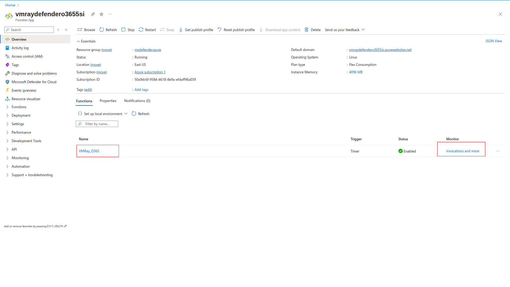

  4. Go to the Invocation tab.
     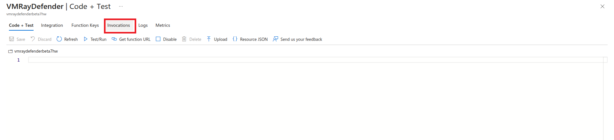

  5. Find the execution based on the start time received in the email and match it with the invocation_id from the email.
     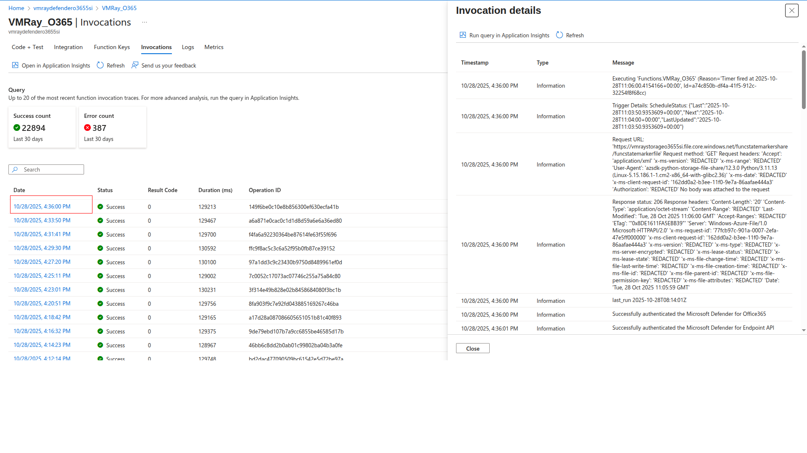

  6. Review all logs under the selected execution.
