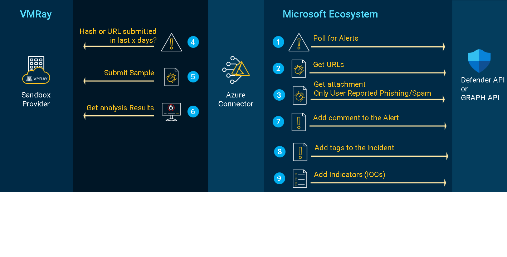
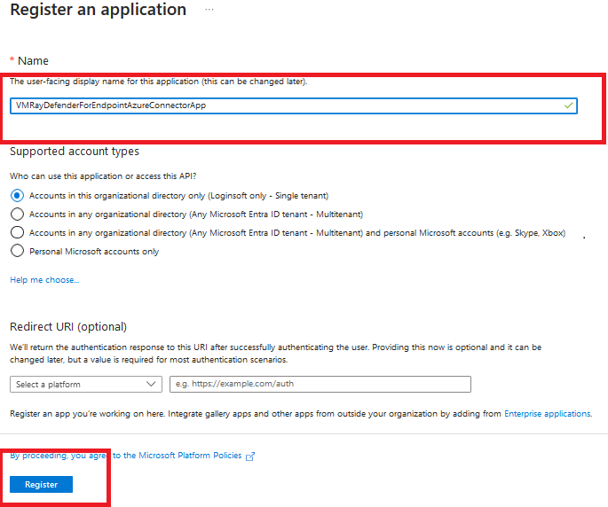
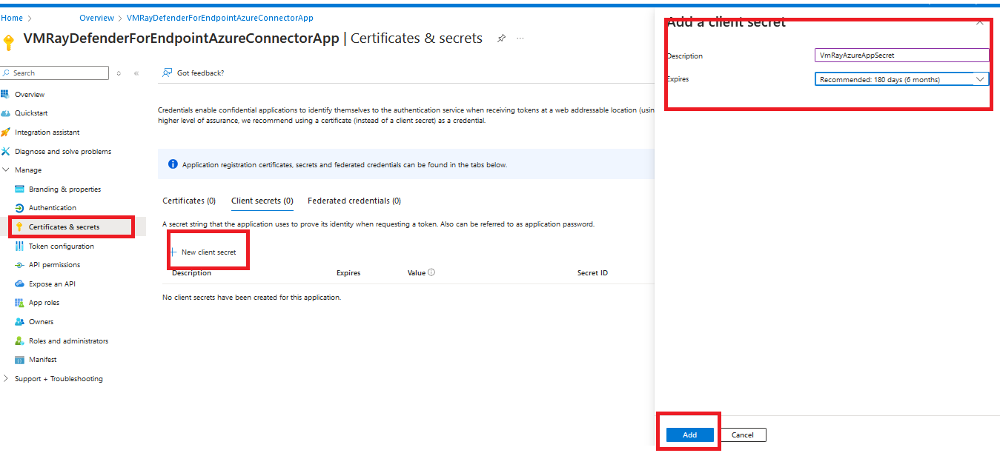
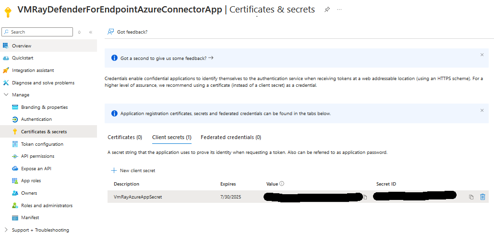
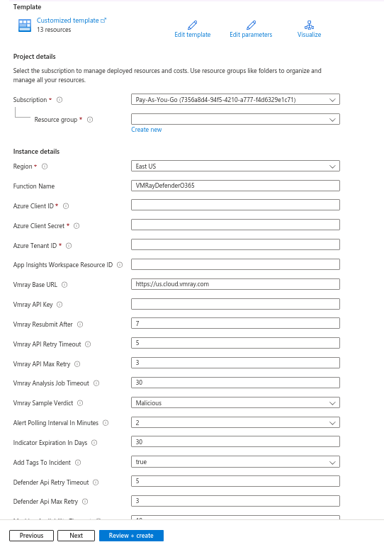
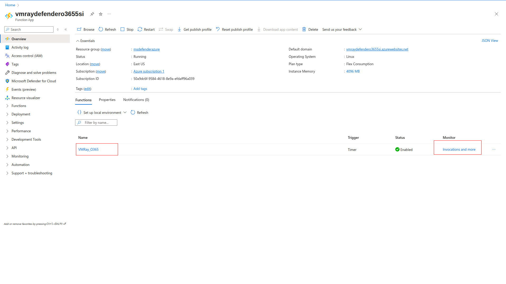
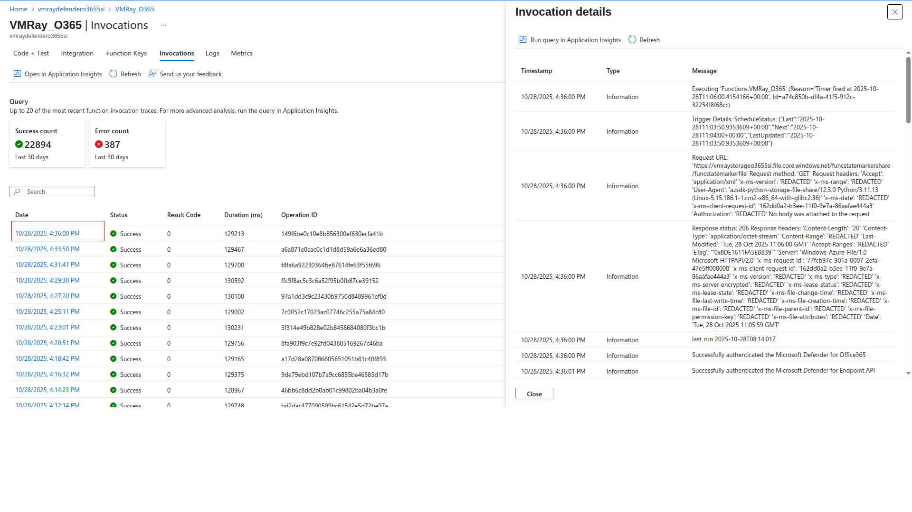

# Microsoft Defender for Office365 Azure Connector for VMRay Advanced Malware Sandbox

**Latest Version:** 1.0.5 - **Release Date: 27/08/2026** 

## Overview

This project provides an integration between Microsoft Defender for Office 365 (MDO) and VMRay products — FinalVerdict and TotalInsight.

### Why to integrate MDO with VMRay?

- **Understand Attacker Intent**: Gain full visibility into the next stage of a phishing attack with detailed insight into attacker behavior and objectives.
- **Streamline Alert Triage**: Get instant clarity within Microsoft Defender alerts — including verdicts, malware names, classifications, and VTI data. The integration automatically analyzes both the phishing URL(s) and any payloads they may download.
- **User Reported Phishing**: The connector fetches **both the URLs and the attachment** for spam or phishing reported by user. As dangerous phishing kits bypass usual email security, these attacks will first be detected in URP mailbox. VMRay dynamic analysis can automatically uncover and block them (using indicators) before a SOC analyst has time to review them.
- **Enhance Protection**: Automatically add IOCs from VMRay analysis to Microsoft Defender indicators, strengthening defenses and preventing future attacks.
- **Accelerate Incident Response**: Access comprehensive, in-depth sandbox reports directly from VMRay to speed up investigation and resolution.

### Technical Solution Overview
- The connector build using Azure Function App.
  1. The function app is time triggered function app. It's continuously fetching `O365` alerts from defender portal.
  2. Azure function app `VMRay_O365` checks if the alert contains a Url and checks if the Url is white-listed (URL Regex exclusion) or has already been analyzed by VMRay.
  3. If the alert was User Reported Phishing (URP) or User Reported Spam, the function app upload the attachment.
  4. If the Url or attachment were already analysed, it checks the time period configured by the user to reanalyze the sample.
  5. Azure function app `VMRay_O365` submits the sample to VMRay for analysis
  6. Azure function app gets the analysis results.
  7. Comment is added to Defender alert
  8. Comment is added to the parent Defender incident (if Add Comments To Incident is enabled)
  9. Tags indicating verdict and threat names are added to the incident
  10. IOCs are added to Defender indicators
 
     
### Features
- **Automatic URL Extraction from Defender Alerts**: The connector automatically retrieves URLs from multiple Defender alert types, including: Emails reported as phishing or spam, Detected malicious emails, Phishing or blocked URLs, Potentially malicious URL clicks, Emails removed after delivery and any Custom alerts you may create,
- **Configurable URL Submission to VMRay**: URLs are submitted to VMRay for analysis if no prior analysis exists within a configurable time window (e.g., the past x days).
- **Comprehensive Analysis Integration**: Analysis results for all samples—including multiple URLs and any child samples—are added as comments to the corresponding Microsoft Defender alert. Each comment includes the analysis date for traceability.
- **Incident Comment Enrichment**: VMRay analysis results are also appended as comments on the parent Defender incident (in addition to the alert), with built-in deduplication to avoid repeated posts across multiple alerts of the same incident.
- **Automatic IOC Enrichment in Defender**: Malicious and suspicious IOCs identified by VMRay are automatically added as Microsoft Defender indicators. Separate configurable actions (e.g., block, audit) can be defined for Malicious vs. suspicious verdicts, and files vs URLs/IPs). IOC expiration time is fully configurable.
- **Incident Tagging in Defender**: Defender incidents are automatically tagged with the most severe verdict identified by VMRay (across multiple related alerts) and the associated threat name extracted from analyzed URLs
- **Serverless Architecture**: The connector is deployed on Azure as a serverless function app with blob storage. Deployment is simplified via a one-click setup directly from GitHub.
- **Simplified Debugging and Logging**: Detailed execution logs are available within the Azure Function App. Alerts are annotated if no URL is found or if the function encounters an error during execution
- **Configurable Polling Interval**: The frequency at which Defender alerts are fetched (polling interval) can be adjusted to fit operational requirements.
#### Known Issues
- Teams Alerts: URLs cannot currently be extracted from Teams alerts due to API limitations in Microsoft Defender and Microsoft Graph.
- Email Attachments: File attachments are only analyzed for User Reported phishing/Spam. For other alerts, they are inaccessible once the email has been removed or quarantined.
## Requirements
- Microsoft Defender for Office365.
- VMRay FinalVerdict, VMRay TotalInsight.
- Microsoft Azure
  1. Azure functions with Flex Consumption plan.
     Reference: https://learn.microsoft.com/en-us/azure/azure-functions/flex-consumption-plan
	 **Note: Flex Consumption plans are not available in all regions, please check if the region your are deploying the function is supported, if not we suggest you to deploy the function app with premium plan. **
	 Reference: https://learn.microsoft.com/en-us/azure/azure-functions/flex-consumption-how-to?tabs=azure-cli%2Cvs-code-publish&pivots=programming-language-python#view-currently-supported-regions
  2. Azure storage with Standard general-purpose v2.

## VMRay Configurations

- In VMRay Console, you must create a Connector API key by following the steps below:
  
  1. Create a user dedicated to this API key (to avoid that the API key is deleted if an employee leaves)
  2. Create a role that allows to "View shared submission, analysis and sample" and "Submit sample, manage own jobs, reanalyse old analyses and regenerate analysis reports".
  3. Assign this role to the created user
  4. Login as this user and create an API key by opening Settings > Analysis > API Keys.
  5. Please save the keys, which will be used in configuring the Azure Function.

## Microsoft Defender for Endpoint Configurations

### Creating Application for API Access

- Open [https://portal.azure.com/](https://portal.azure.com) and search `Microsoft Entra ID` service.


- Click `Add->App registration`.


- Enter the name of application, select supported account types, and click on `Register`.



- In the application overview you can see `Application Name`, `Application ID` and `Tenant ID`.


- After creating the application, we need to set API permissions for connector. For this purpose,
  - Click `Manage->API permissions` tab
  - Click `Add a permission` button
  - Select `APIs my organization uses`
  - Search `WindowsDefenderATP` and click the search result


- On the next page, select `Application Permissions` and check the permissions according to the table below. Then, click `Add permissions` button below.
### WindowsDefenderATP
|       Category       |   Permission Name   | Description                                                            |
|:---------------------|:--------------------|:-----------------------------------------------------------------------|
| Alert                | Alert.ReadWrite.All | Needed to retrieve alerts and enrich them with sample information      |
| Ti                   | Ti.ReadWrite.All | Needed to retrieve and submit indicators (general)                     |


- Follow the same steps as above to provide permission for `Microsoft Graph API`

### Microsoft Graph
| Category                      | Permission Name     | Description                                                           |
|:------------------------------|:--------------------|:----------------------------------------------------------------------|
| SecurityAlert.ReadWrite.All   | Alert.ReadWrite.All | Read and write to all security alerts                                 |
| SecurityIncident.ReadWrite.All| Incident.ReadWrite  | Read and write to all security incidents       |
| ThreatHunting.Read.All        | Hunting.Read.All    | Run hunting queries                    |
|  Mail.Read        | Mail.Read    | Read mail in all mailboxes                    |


- After setting only the necessary permissions, click the `Grant admin consent for ...` button to approve permissions.


- We need secrets to access programmatically. For creating secrets
  - Click `Manage->Certificates & secrets` tab
  - Click `Client secrets` tab
  - Click `New client secret` button
  - Enter description and set expiration date for secret



- Use Secret `Value` and `Secret ID` to configure connector.



**Reference**
- [https://docs.microsoft.com/en-us/microsoft-365/security/defender-endpoint/api-hello-world](https://docs.microsoft.com/en-us/microsoft-365/security/defender-endpoint/api-hello-world)


## Microsoft Azure Function App Installation And Configuration

### Deployment of Function App 

#### Flex Consumption Plan

- Click on below button to deploy:

  [](https://portal.azure.com/#create/Microsoft.Template/uri/https%3A%2F%2Fraw.githubusercontent.com%2Fvmray%2Fms-defender-MDO%2Frefs%2Fheads%2Fmain%2FFunctionApp%2Fazuredeploy.json)

#### Premium Plan

- Click on below button to deploy:

  [](https://portal.azure.com/#create/Microsoft.Template/uri/https%3A%2F%2Fraw.githubusercontent.com%2Fvmray%2Fms-defender-MDO%2Frefs%2Fheads%2Fmain%2FFunctionApp%2Fazuredeploy_premium.json)

- On the next page, please provide the values accordingly.
  


| Fields                                                  | Description                                                                                                                                        |
|:--------------------------------------------------------|:---------------------------------------------------------------------------------------------------------------------------------------------------
| Subscription		                                          | Select the appropriate Azure Subscription                                                                                                          | 
| Resource Group 	                                        | Select the appropriate Resource Group                                                                                                              |
| Region			                                               | Based on Resource Group this will be auto populated                                                                                                |
| Function Name		                                         | Please provide a function name if needed to change the default value                                                                               |
| Azure Client ID                                         | Enter the Azure Client ID created in the App Registration Step                                                                                     |
| Azure Client Secret                                     | Enter the Azure Client Secret created in the App Registration Step                                                                                 |
| Azure Tenant ID                                         | Enter the Azure Tenant ID of the App Registration                                                                                                  |
| App Insights Workspace Resource ID                      | Go to `Log Analytics workspace` -> `Settings` -> `Properties`, Copy `Resource ID` and paste here                                                   |
| Vmray Base URL                                          | VMRay Base URL, either https://eu.cloud.vmray.com or https://us.cloud.vmray.com                                                                                                                                    |
| Vmray API Key                                           | VMRay API Key                                                                                                                                      |
| Vmray Resubmit After                                    | Resubmit when the previous analysis is older than X days. The value represents the number of days (range 0–100), where 0 means resubmit every time |
| Vmray API Retry Timeout                                 | Provide maximum time to wait in minutes, when VMRay API is not responding                                                                          |
| Vmray API Max Retry                                     | Provide number of retries, when VMRay API is not responding                                                                                        |
| Vmray Analysis Job Timeout                              | Provide maximum time to wait in minutes, when VMRay Job submissions is not responding                                                              |
| Alert Polling Interval In Minutes                       | Select how often the connector check if there are new alerts. Use Cron format, such as */10 * * * *   for 10 minutes                                                                                                                            |
| Indicator Expiration In Days                            | Please specify the number of days the indicator should remain valid.                                                                               |
| Add Tags To Incident | If true, VMRay verdict and threat names will be added to incidents tag in Defender console.                                                                                |
| Add Comments To Incident | If true, VMRay enrichment comments will be appended to the parent incident of each processed alert.                                                                                |
| Defender API Retry Timeout                              | Provide maximum time to wait in minutes, when Microsoft Defender API is not responding.                                                            |
| Defender API Max Retry                                  | Provide number of retries, when Microsoft Defender API is not responding                                                                           |
| Create Indicators In Defender                           | If true, Indicators will be created in Microsoft Defender                                                                                          |
| Vmray Sample Verdict                                    | Based on the selection, Indicators will be created in Microsoft Defender                                                                           |
| Defender Indicator Action For Malicious IP Address URL  | The action that is taken if the indicator is Malicious URL or IP Address discovered in the organization                                            |
| Defender Indicator Action For Suspicious IP Address URL | The action that is taken if the indicator is Suspicious URL or IP Address discovered in the organization                                           |
| Defender Indicator Action For Malicious File            | The action that is taken if the indicator is Malicious File discovered in the organization                                                         |
| Defender Indicator Action For Suspicious File           | The action that is taken if the indicator is Suspicious File discovered in the organization                                                        |
| Defender Indicator Alert | True if alert generation is required, False if this indicator shouldn't generate an alert                                                          |
| Minimum Alert Age | Minimum age of alerts in minutes.                                                        |
| URL Exclusion Regex | Comma separated list of regular expressions (not wildcards). Any URL matching one of them is skipped and never submitted to VMRay. See [URL Exclusion Regex examples](#url-exclusion-regex-examples) below.                |
| Analyze URP Attachments | If true, User Reported Phishing attachments will be analyzed               |
| Add AlertId Tags | If true, Alert ID will be added as tags to VMRay submissions. This cannot be used before VMRay platform release 2026.2 as special character in tags are not supported before that.                |
| Lookback Email Days | Lookback period for email in days.              |
| Alerts Severity | Only alerts with the specified severity levels will be processed. Enter severity levels separated by commas (e.g., informational, low, medium, high)               |
	
- Once you provide the above values, please click on `Review + create` button.

### URL Exclusion Regex examples

The `URL Exclusion Regex` setting takes a **comma separated list of regular expressions** — not
wildcards. Any URL matching at least one of them is skipped and never submitted to VMRay.

Points to keep in mind when writing a pattern:

- A dot in a regular expression matches *any* character, so escape it as `\.` when you mean a
  literal dot. `contoso.com` also matches `contosoXcom`.
- Anchor the pattern with `^` so that it has to match from the start of the URL. Without an anchor,
  `contoso\.com` also matches `https://notcontoso.com.example.ru/`, which is probably not intended.
- Matching is case-insensitive, so `CONTOSO.COM` is covered by a lowercase pattern.
- Wildcard-style entries such as `*.loc` are **not** valid regular expressions. An invalid entry is
  written to the Function App logs and ignored; the remaining patterns keep working.
- Surrounding spaces around the commas are trimmed, so both `a,b` and `a, b` work.
- A comma always separates two entries, so a pattern cannot itself contain a comma. Use `x{2}x{3}`
  style repetition instead of `x{2,3}`.

| Goal | Pattern |
|:-----|:--------|
| A domain and all its subdomains | `^https?://([^/]*\.)?contoso\.com(/\|\?\|$)` |
| One exact host only | `^https?://contoso\.com(/\|\?\|$)` |
| Outlook Safe Links wrappers | `^https?://[^/]*\.safelinks\.protection\.outlook\.com/` |
| Any host ending in an internal TLD | `^https?://[^/]*\.loc(/\|\?\|$)` |
| Every Microsoft-owned host | `^https?://([^/]*\.)?microsoft\.com(/\|\?\|$)` |
| A specific URL path prefix | `^https?://intranet\.contoso\.com/public/` |

Combining the first two rows of the table into a single setting value:

```
^https?://([^/]*\.)?contoso\.com(/|\?|$), ^https?://[^/]*\.safelinks\.protection\.outlook\.com/
```

After changing the setting, the Function App picks up the new value on its next restart. On every
polling cycle the logs report how many patterns were loaded, and name any entry that was rejected as
invalid, which is the quickest way to confirm the setting is being applied as intended.


## Automated Deployment (PowerShell Script)

> As an alternative to manually clicking through the Azure Portal steps above, `Scripts/Deploy-VMRayMDOConnector.ps1` is an interactive PowerShell script that automates the App Registration and Function App deployment phases (including the API permissions, client secret, and admin consent steps that are otherwise manual). It's designed to run from Azure Cloud Shell.
>
> The only step that may still require a manual click is admin consent, and only if the script can't grant it for you — in that case it prints the consent URL to forward to a Global Administrator.
>
> See [docs/AUTOMATED-DEPLOYMENT.md](docs/AUTOMATED-DEPLOYMENT.md) for the full guide, including prerequisites, step-by-step usage, re-deployment / existing App Registration reuse, and troubleshooting.

## Debugging
- To debug and check logs after receiving an email, follow these steps:
  1. Navigate to the Azure Function App.
  2. Select the function that starts with "vmraydefendero365".
  3. In the Function section below, choose "VMRay_O365" and click on "Invocations and more".
     

  4. Go to the Invocation tab.
     

  5. Find the execution based on the start time received in the email and match it with the invocation_id from the email.
     

  6. Review all logs under the selected execution.
 
## Version History

| Version        | Release Date | Release Notes
|:---------------|:-------------|:---------------- |
| 1.0.5          | `27-08-2026` | <ul><li>Added an automated deployment option: the interactive PowerShell script `Scripts/Deploy-VMRayMDOConnector.ps1` automates the App Registration and Function App deployment, as an alternative to the manual Azure Portal steps. See [docs/AUTOMATED-DEPLOYMENT.md](docs/AUTOMATED-DEPLOYMENT.md) for the full guide.</li><li>Bug fix: surrounding whitespace is now trimmed from each `URL Exclusion Regex` entry. Previously a value written as `pattern1, pattern2` gave the second pattern a literal leading space, so it could never match a URL.</li><li>Improvement: an invalid `URL Exclusion Regex` entry is now written to the Function App logs and skipped, leaving the remaining patterns and the alert processing working. Previously one bad pattern interrupted evidence collection for the alert.</li><li>Rewrote the `URL Exclusion Regex` documentation with worked examples, and clarified that the setting takes regular expressions rather than wildcards.</li></ul> |
| 1.0.4          | `04-05-2026` | <ul><li>Improvement: Added option to also append VMRay enrichment comments to the parent Defender incident (controlled by `Add Comments To Incident`). Includes per-incident dedup to avoid repeated posts across multiple alerts of the same incident.</li></ul> |
| 1.0.3          | `27-02-2026` | <ul><li>Improvement: Analyse email attachment related to User Reported Phishing or Junk MDO alerts.</li><li>Improvement: Whitelist URLs with Regex.</li><li>Improvement: Configurable number of days for email in KQL query: first query with 24 hours, retry with configured email age.</li><li>Add Alert ID tags to submissions.</li><li>Improvement: Filter submissions by severity.</li></ul> |
| 1.0.2          | `19-12-2025` | <ul><li>Improvement: To reduce the amount of queries on Graph API to fetch URL, the minimum alert age was introduced. It ensures that we try to fetch the url only x minutes (default 5) after the alert.</li><li>Default value adjustment: The default amount of retries was reduced to 2 and time between retries increased to 1 minute.</li><li>Bug fix: In the KQL query to fetch URL related to the email, the email age was reduced to 24 hours instead of 30 days that was too heavy in large deployments.</li></ul> |
| 1.0.1          | `10-12-2025` | <ul><li>Improvement: Added indication in alert if no url is found</li><li>Improvement: Filter out threat names from AV engine to ensure better clarity</li><li>Bug fix: Threat name from child sample was not visible in Incident tag.</li><li>Default value adjustment: default alert polling time increased to 3 minutes as URL takes typically over 3 minutes to appear in the Graph API. Defender API Max retry increased to 12 to ensure getting the URL.</li></ul> |
| 1.0.0 	 | `28-10-2025` | <ul><li>Initial release</li><li>Enrich alert's comment with url analysis and their child sample</li><li>Upload IOCs to Defender indicators with configurable actions and expiration time</li><li>Add tags to incidents with VMRay most severe verdict and threat names</li></ul> |
